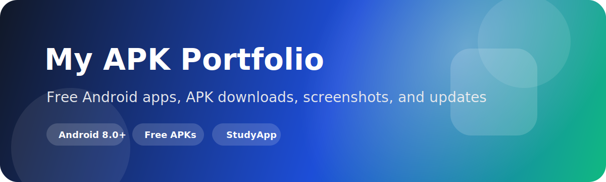
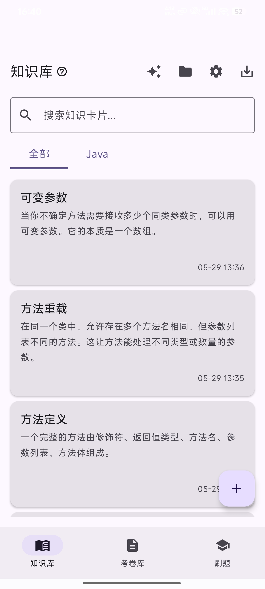
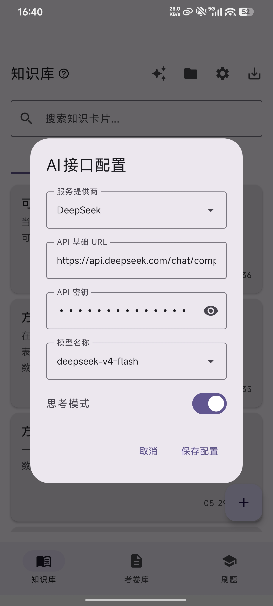
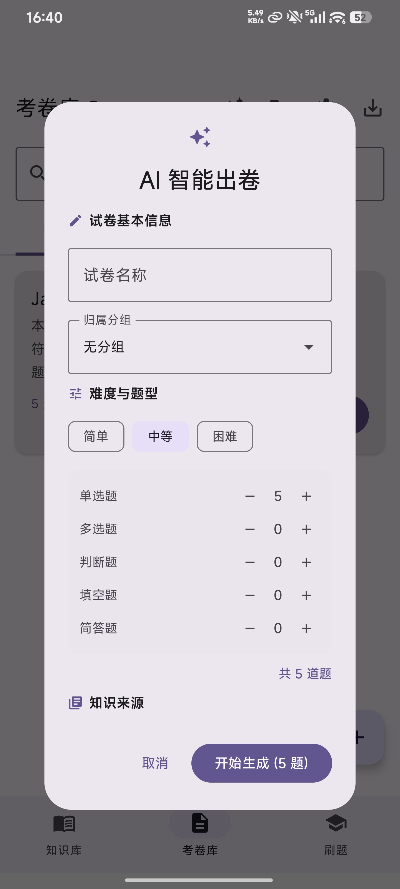
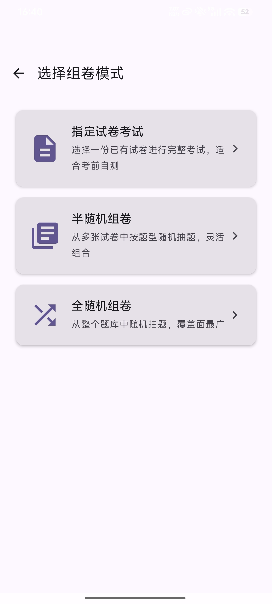
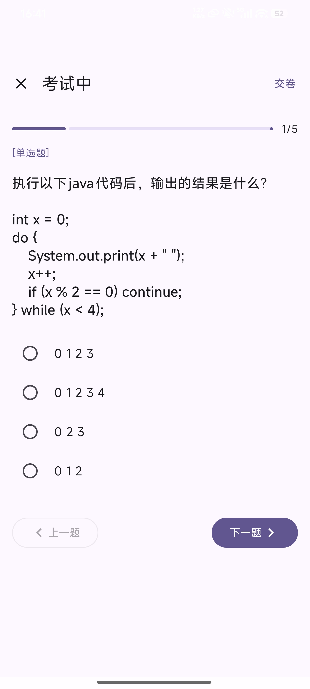
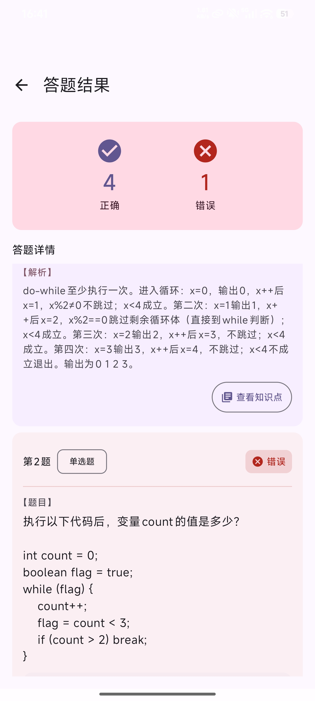

# 🎒 My APK Portfolio

**A collection of free Android APK apps built with passion.**

---

## 📦 App List

### 1. [📚 StudyApp](./studyApp) — Your Pocket Study Buddy

A three-in-one Android study app: **Take notes → Make quizzes → Practice**, great for exam prep, review, and drilling knowledge.

- Knowledge card management, TXT/DOCX import, AI auto-extract key points
- 5 question types for exam creation, AI one-click exam generation
- Multiple quiz modes, auto-grading
- Built-in HTTP server for typing answers on your computer

  
  
  

  
  
  

 

👉 [View Details](./studyApp) · [Download from Releases](https://github.com/TTHQT/apkAll/releases)

---

## 📥 How to Install

1. Go to the [Releases](https://github.com/TTHQT/apkAll/releases) page
2. Download the latest `.apk` file
3. Install it on your Android phone (minimum Android 8.0)

> ⚠️ Make sure you've enabled **"Install from unknown sources"** before installing.

---

## 🧩 More Apps

More APKs are on the way — I'll keep adding to this repository. Stay tuned ✨

---

## 🔎 Recommended Repository Topics

For better GitHub discoverability, this repository is best tagged with:

`android` · `apk` · `android-apps` · `apk-collection` · `studyapp`

---

## 🌟 About This Repository

This is my personal APK collection, all built out of pure interest and hobby. If you find them interesting or useful, feel free to ⭐ Star to show your support!

---

  Made with ❤️ + ☕ + 🧠 + 🤖

